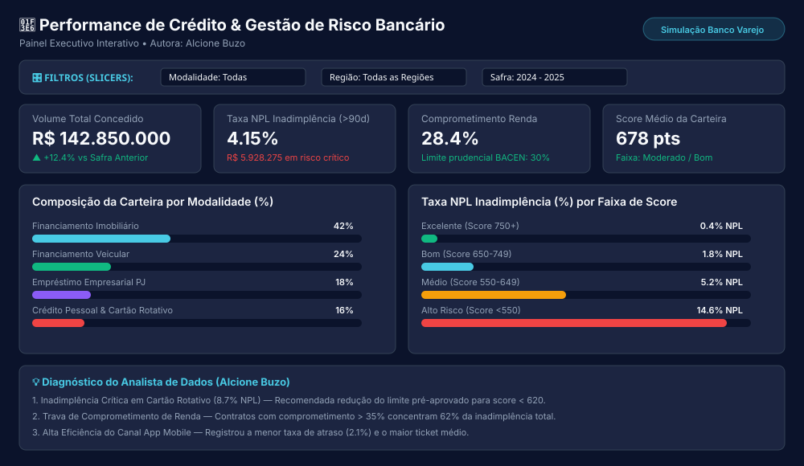

  🌐 <b>Idiomas:</b> <a href="README.md"><b>🇧🇷 PT</b></a> | <a href="README.en.md"><b>🇺🇸 EN</b></a> | <a href="README.es.md"><b>🇪🇸 ES</b></a>

# Hola, soy Alcione Buzo 👋

Profesional graduada en **Bases de Datos, Business Intelligence, Big Data y Data Science por la FIAP** (2021).  
Inicio una nueva etapa de actualización profesional, aprendizaje continuo y desarrollo de proyectos de datos. Este repositorio registra esta trayectoria de forma transparente.

---

## 🎯 Enfoque Actual
- **Análisis e Ingeniería de Datos:** SQL, modelado relacional y dimensional (Star Schema).
- **Business Intelligence & Analytics:** Visualización de datos, métricas financieras y dashboards ejecutivos.
- **Python y Automatización de Datos:** Limpieza de datos y automatizaciones con **n8n**.
- **IA y Automatización:** Uso asistido de IA para automatizar flujos de trabajo.

---

## 📂 Proyectos del Repositorio

### 📊 1. PROYECTOS DE DATOS

#### 📈 [Proyecto 01: Análisis de Riesgo de Crédito y Morosidad Bancaria](./02_projetos_de_dados/01_analise_risco_credito_bancario)
> **Proyecto Completo de BI y Analítica** enfocado en el sector financiero. Cubre todo el pipeline de datos: limpieza en Excel, modelado y consultas avanzadas en SQL, medidas DAX en Power BI y diagnósticos ejecutivos de riesgo.

- **Stack:** `Excel (Power Query)` | `SQL (PostgreSQL - CTEs & Window Functions)` | `Power BI (DAX & Star Schema)` | `HTML5 Dashboard`
- 📁 **[Acceder a la carpeta del proyecto](./02_projetos_de_dados/01_analise_risco_credito_bancario)**

---

### 🌐 2. PROYECTO EXTRA

#### 🔗 [HUB1 Academy — Plataforma Digital y Diagnóstico Empresarial](./01_projeto_extra_hub1)
- 📁 **[Acceder al estudio de caso HUB1](./01_projeto_extra_hub1)**
- 🔗 **[Visitar el sitio oficial de HUB1 Academy](https://hub1academy.com.br/)**

---

## 🎓 Formación Académica
- **Bases de Datos, BI, Big Data y Data Science** — FIAP (2021).

---

## 🛠️ Habilidades Técnicas
- **Datos y BI:** Bases de Datos · SQL · Business Intelligence · Big Data · Data Science · Modelado de Datos · DAX · Power Query.
- **Automatización y Tecnología:** n8n · Python · WordPress · HTML/CSS/JS · UX/UI · Gestión de Proyectos · IA.

---

## 📬 Contacto y Redes
- **LinkedIn:** [linkedin.com/in/alcioneoliveira](https://www.linkedin.com/in/alcioneoliveira/)
- **GitHub:** [github.com/AlcioneBuzo](https://github.com/AlcioneBuzo)
